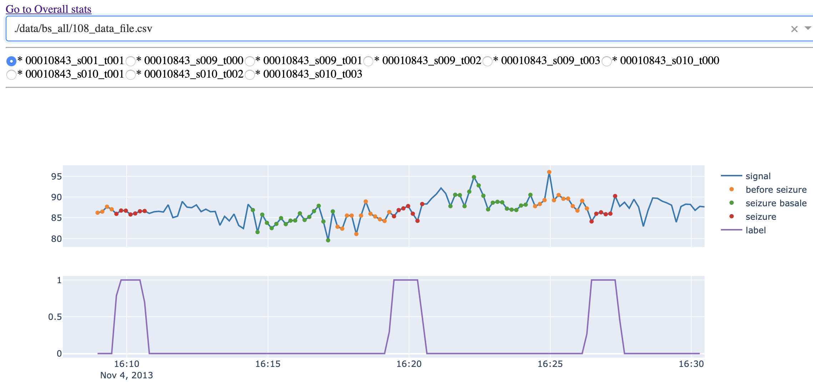
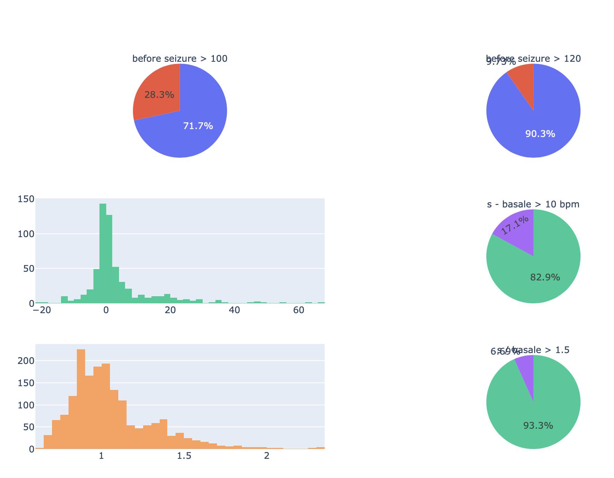

# Temple University EEG Corpus
Data analysis and visualization of TUH ECG dataset.

The goal of this analysis is to observe if before or during a seizure, the heart rate signal follows one or more tachycardia definition.

Various definitions of tachycardia :

- FC > 100 bpm
- FC > 120 bpm
- delta FC > 10 bpm relative to pre critical state
- delta FC > 15 bpm relative to pre critical state
- FC > basale state + 50 % basale state
- FC > basale state + 60 % basale state
- FC > basale state + 34 bpm

Basale state being a "quiet" state. Not at pre ictal (pre seizure) or ictal (seizure) state.

## Retrieve data
Data are accessible through https://isip.piconepress.com/projects/tuh_eeg/html/downloads.shtml

## Data

data/bs_window_type_X_diff_file.csv = for each records of all patients selected, we selected a before seizure window of X seconds, and computed difference between basale heart rate mean, and selected region heart mean.

## Launch data visualization

python app.py

